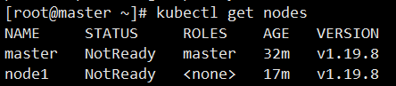
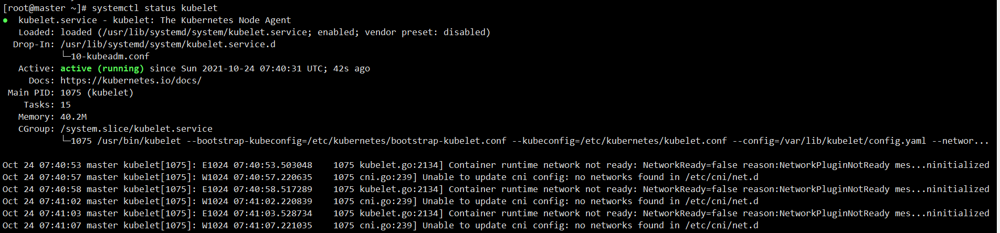
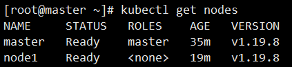
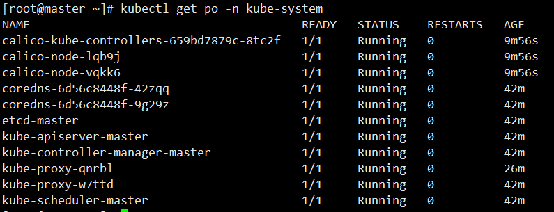

## 介绍

本文基于kubeadm快速部署一套Kubernetes集群用于个人学习和测试，针对国内网络环境选择合适的镜像源，减少镜像下载时间，并安装calico网络插件。

<!--more-->

## 环境准备

本次环境由两台虚拟机来部署，安装CentOS7.6系统：

| 主机名 |    IP    |
| :----: | :------: |
| master | 10.0.0.3 |
| node1  | 10.0.0.4 |

### 配置hostname与host

分别在两台主机上执行命令，修改主机名：

```shell
# 10.0.0.3节点
hostnamectl set-hostname master

# 10.0.0.4节点
hostnamectl set-hostname node1
```

> hostnamectl 命令会替换`/etc/hostname`文件中的主机名，保证重启后主机名还是生效；
>
> hostname 命令可以临时修改主机名，重启后失效。

两台机器都要配置host，允许主机通过主机名直接通信，`/etc/hosts`文件添加一下配置：

```shell
10.0.0.3 master
10.0.0.4 node1
```

### 关闭防火墙

```shell
systemctl stop firewalld
systemctl disable firewalld
systemctl status firewalld
```

### 关闭selinux

```shell
sed -i 's/SELINUX=enforcing/SELINUX=disabled/g' /etc/selinux/config  # 永久 需重启
setenforce 0   # 临时
```

### 关闭swap

```shell
swapoff -a
sed -i 's/^[^#].*swap/#&/' /etc/fstab
systemctl daemon-reload
```

若要启用swap设备，则需要在集群初始化时添加 `--ignore-preflight-errors=swap`，可忽略因swap设备导致的报错。

### 关闭ipv6

```shell
echo net.ipv6.conf.all.disable_ipv6=1 >> /etc/sysctl.conf
echo NETWORKING_IPV6=no >> /etc/sysconfig/network
sed -i 's/IPV6INIT=yes/IPV6INIT=no/g' /etc/sysconfig/network-scripts/ifcfg-ens33
sysctl -p
ip a             # 查看ipv6是否关闭
```

### 将桥接的ipv4流量传递到iptables

```shell
cat >/etc/sysctl.d/kubernetes.conf << EOF
net.bridge.bridge-nf-call-ip6tables =1
net.bridge.bridge-nf-call-iptables =1
EOF

sysctl --system  # 生效
```

> 这个不知道什么意思但是通过Kubeadm安装Kubenetes集群时会校验。这里也搜到[一篇文章](https://www.joeys.top/2021/01/iptable-net-bridge-bridge-nf-call-iptables%E7%9A%84%E4%BD%9C%E7%94%A8/)说明`net.bridge.bridge-nf-call-iptables的作用`参数作用，不明所以。

### 安装Docker

容器运行时是运行容器的基础，有多种可选的容器运行时，这里选择kubernetes默认的Docker。

```shell
# 安装 yum-utils
sudo yum install -y yum-utils

# 设置 yum 源为阿里云方便下载 Docker Engine
sudo yum-config-manager --add-repo http://mirrors.aliyun.com/docker-ce/linux/centos/docker-ce.repo

# 安装最新版的docker，不同版本的k8s适配的docker版本不同，所以可能需要指定docker版本
sudo yum install docker-ce docker-ce-cli containerd.io
# 获取docker版本列表
sudo yum list docker-ce --showduplicates | sort -r
# 安装指定版本的docker
sudo yum install docker-ce-<VERSION_STRING> docker-ce-cli-<VERSION_STRING> containerd.io
sudo yum install docker-ce-19.03.9-3.el7 docker-ce-cli-19.03.9-3.el7 containerd.io

# 启动 docker
sudo systemctl start docker

# 设置开机启动
sudo systemctl enable docker
```

**并且配置Docker的Cgroup Driver为systemd：**

```shell
vi /etc/docker/daemon.json

{
    "exec-opts":["native.cgroupdriver=systemd"]
}

systemctl restart docker
```

- 什么是cgroups?

  首先说下容器是什么？容器是一个视图隔离、资源可限制、独立文件系统的进程集合。cgroups(Control Groups) 是 linux 内核提供的一种机制，作用就是可以对资源进行限制。此外，视图隔离是通过namespace实现，而文件系统是通过chroot实现。

- 为什么要修改Cgroup Driver？

  Docker默认的Cgroup Driver是cgroupfs，而Kubernetes 推荐使用 systemd 来代替 cgroupfs。如果不修改，那么同时运行有两个cgroup控制管理器，当资源有压力的情况时，有可能出现不稳定的情况。并且在kubeadm init时也会出现警告。

### master节点配置免密登录node节点

```shell
ssh-keygen -t rsa # 一路默认回车即可
ssh-copy-id master   # 过程中需要输入密码
ssh-copy-id node1

ssh root@node1   # 测试是否成功
```

## 集群部署

### 安装kubeadm、kubelet、kubectl

以下操作在所有节点进行

- 添加阿里云YUM源

  ```shell
  cat >/etc/yum.repos.d/kubernetes.repo << EOF
  [kubernetes]
  name=Kubernetes
  baseurl=https://mirrors.aliyun.com/kubernetes/yum/repos/kubernetes-el7-x86_64
  enabled=1
  gpgcheck=0
  repo_gpgcheck=0
  gpgkey=https://mirrors.aliyun.com/kubernetes/yum/doc/yum-key.gpg https://mirrors.aliyun.com/kubernetes/yum/doc/rpm-package-key.gpg
  EOF
  ```

- 指定版本安装软件，这里安装1.19.8版本，1.20不再把Docker作为默认的容器运行时，所以这里选择1.19版本

  ```shell
  yum install -y kubelet-1.19.8 kubeadm-1.19.8 kubectl-1.19.8
  systemctl enable kubelet
  ```

### Master节点安装

```shell
kubeadm init --kubernetes-version=1.19.8 --image-repository=registry.aliyuncs.com/google_containers
```

安装成功之后，按照提示执行下列命令：

```shell
mkdir -p $HOME/.kube
sudo cp -i /etc/kubernetes/admin.conf $HOME/.kube/config
sudo chown $(id -u):$(id -g) $HOME/.kube/config
```

同时要记住打印出的下列命令，用于添加Node节点：

```shell
kubeadm join 10.0.0.3:6443 --token j91yvn.qvhw9t0n0nvjd9j7 \
    --discovery-token-ca-cert-hash sha256:68f5132eed6c9a9f1dc59cd304220542e4635dbf629cc789d0d0e0b91bb909cd
```

若没注意，可通过`kubeadm token list`查看当前的token，默认有效期为24小时，若忘记token或token过期，可使用命令`kubeadm token create --print-join-command`重新生成，若初始有问题可通过命令`kubeadm reset`重置。

启动kubelet：

```shell
systemctl start kubelet
```

### Node节点安装

```shell
systemctl start kubelet

kubeadm join 10.0.0.3:6443 --token j91yvn.qvhw9t0n0nvjd9j7 \
    --discovery-token-ca-cert-hash sha256:68f5132eed6c9a9f1dc59cd304220542e4635dbf629cc789d0d0e0b91bb909cd
```

### 安装calico

master与node节点安装好之后，获取一下节点信息：

```shell
kubectl get nodes
```



可以看到master节点与node1节点都处于NotReady状态。查看kubelet的状态：

```shell
systemctl status kubelet
```



 `No networks found in /etc/cni/net.d` 这行错误信息表示节点没有CNI网络插件，这是因为kubeadm目标是在不安装其他功能插件的基础上，建立一个通过Kubernetes一致性测试Kubernetes Conformance tests的最小可行集群。它在设计上并不会安装网络解决方案，而是需要用户自行安装第三方符合CNI的网络解决方案（如：flannel，calico，weave network等）。

fannel和calico算是目前网络实现最热门的2个插件，经过简单的对比，calico在性能更好以外，还可以与服务网格 Istio 集成，所以毫不犹豫的选择calico。

```shell
curl https://docs.projectcalico.org/manifests/calico.yaml -o calico.yaml
```

```shell
kubectl apply -f calico.yaml 
```

安装好calico相关组件之后，再次查看节点状态变为Ready：



再查看基础应用：



到此，一个kubenetes集群就搭建完毕，可以在该集群上创建deployment部署应用，创建service暴露服务了。