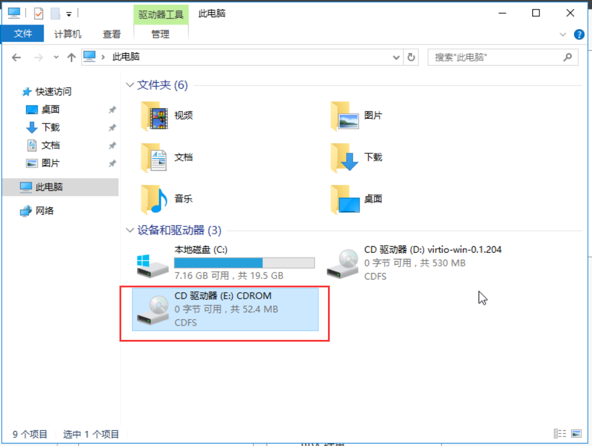

在 KVM 环境创建具有图形化界面的 windows 虚机之后，虚机可能在某些情况下无法连接外网，比如网卡驱动未安装的情况下。这时需要在虚机里面安装软件就显得特别麻烦，比如需要安装 windows 虚机镜像初始化软件 cloudBase-init。本文介绍一种通过给 windows 虚机挂载磁盘的方式共享宿主机文件的方法。

<!--more-->

##### 准备文件

先将需要放到 iso 中的文件准备好，我这里准备了 cloudBase-init 的安装程序，放到 cloudbase 目录中：

```shell
# ls cloudbase/
CloudbaseInitSetup_Stable_x64.msi
```

##### 创建iso镜像文件

然后用 mkisofs 命令将 cloudbase/ 目录打包到一个名叫 cloudbase.iso 的镜像文件中：

```shell
# mkisofs -r -v -o cloudbase.iso cloudbase/
I: -input-charset not specified, using utf-8 (detected in locale settings)
genisoimage 1.1.11 (Linux)
Scanning cloudbase/
Writing:   Initial Padblock                        Start Block 0
Done with: Initial Padblock                        Block(s)    16
Writing:   Primary Volume Descriptor               Start Block 16
Done with: Primary Volume Descriptor               Block(s)    1
Writing:   End Volume Descriptor                   Start Block 17
Done with: End Volume Descriptor                   Block(s)    1
Writing:   Version block                           Start Block 18
Done with: Version block                           Block(s)    1
Writing:   Path table                              Start Block 19
Done with: Path table                              Block(s)    4
Writing:   Directory tree                          Start Block 23
Done with: Directory tree                          Block(s)    1
Writing:   Directory tree cleanup                  Start Block 24
Done with: Directory tree cleanup                  Block(s)    0
Writing:   Extension record                        Start Block 24
Done with: Extension record                        Block(s)    1
Writing:   The File(s)                             Start Block 25
 18.61% done, estimate finish Fri Jan 15 19:50:59 2021
 37.25% done, estimate finish Fri Jan 15 19:50:59 2021
 55.83% done, estimate finish Fri Jan 15 19:50:59 2021
 74.46% done, estimate finish Fri Jan 15 19:50:59 2021
 93.04% done, estimate finish Fri Jan 15 19:50:59 2021
Total translation table size: 0
Total rockridge attributes bytes: 365
Total directory bytes: 0
Path table size(bytes): 10
Done with: The File(s)                             Block(s)    26697
Writing:   Ending Padblock                         Start Block 26722
Done with: Ending Padblock                         Block(s)    150
Max brk space used 0
26872 extents written (52 MB)
```

##### 挂载到虚机中使用

修改虚机 xml 模板文件，添加上述的 iso 镜像文件作为一块磁盘：

```xml
    <disk type='file' device='cdrom'>
      <driver name='qemu' type='raw'/>
      <source file='/var/lib/libvirt/images/windows/cloudbase.iso'/>
      <target dev='hdd' bus='ide'/>
      <readonly/>
      <address type='drive' controller='0' bus='1' target='0' unit='1'/>
    </disk>
```

启动虚机之后，即打开磁盘即可访问到磁盘中的文件，如图

