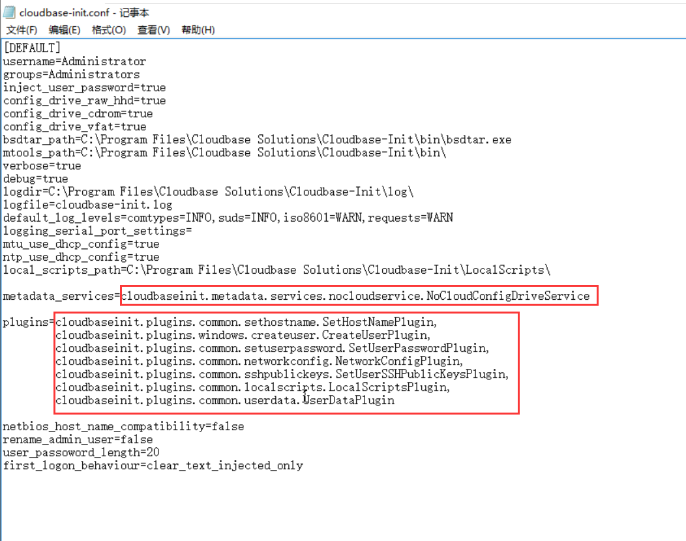

本文以 windows server 2016 系统为例，介绍在 KVM 环境制作 windows 虚机镜像的过程，该镜像主要用于 Kubernetes kubevirt 项目创建虚机，能供通过 cloudBase-init 完成虚机的初始化。

<!--more-->

#### 一、创建windows

##### 1、下载镜像

可以在 www.itellyou.cn 网站上面下载官方系统镜像文件 ，这里下载windows server 2016的镜像，下载好之后放到 KVM 主机中，在 /var/lib/libvirt/images/ 中新建一个 windows 文件夹，用户存放 iso 和后面创建的虚机安装磁盘 qcow2 文件：

```shell
cd /var/lib/libvirt/images/
mkdir windows
cd windows
```

##### 2、创建系统安装磁盘文件

用 qemu-img 命令创建一个 qcow2 格式的磁盘文件，大小设置 20G：

```
qemu-img create -f qcow2 cn_windows_server_2016_x64_dvd_9718765.qcow2 20G
```

##### 3、创建虚机

通过virt-install命令创建虚机，指定虚机系统文件是 iso 文件，安装磁盘是 qcow2 文件：

```
virt-install --name cn_windows_server_2016_x64_dvd_9718765 --memory 8192 --vcpus 4  --cdrom=/var/lib/libvirt/images/windows/cn_windows_server_2016_x64_dvd_9718765.iso  --disk path=/var/lib/libvirt/images/windows/cn_windows_server_2016_x64_dvd_9718765.qcow2,format=qcow2 --network default --graphics vnc,port=5945,listen=0.0.0.0 --channel unix,target_type=virtio,name=org.qemu.guest_agent.0  --virt-type kvm --os-variant windows --noautoconsole
```

通过 vnc 登录虚机，进入 windows 系统安装程序


没有产品密钥，点击 <u>我没有产品密钥</u>：


选择要安装的操作系统，选择第二个有桌面的，点击下一步：


接受许可条款之后，点击下一步。进入下面的界面，选择 <u>自定义：仅安装 Windows（高级）</u>：


选择唯一的一个驱动器，点击下一步：


进入 windows 系统安装过程，这个过程自动完成：


完成上面的系统安装过程之后，虚机会自动关机。

先不要开机，先按照后面的步骤进行操作。

##### 4、卸载系统iso文件

通过下面的命令直接修改虚机 xml 模板，如果不卸载，下次重启还会进入安装系统的过程。

```
virsh edit cn_windows_server_2016_x64_dvd_9718765
```

删除下面几行的配置：

```xml
    <disk type='file' device='cdrom'>
      <driver name='qemu' type='raw'/>
      <source file='/var/lib/libvirt/images/windows/cn_windows_server_2016_x64_dvd_9718765.iso'/>
      <target dev='hdb' bus='ide'/>
      <readonly/>
      <address type='drive' controller='0' bus='0' target='0' unit='1'/>
    </disk>
```

继续后续的操作。

---

#### 二、安装windows镜像需要的驱动

主要需要的驱动有：pci scsi驱动、ballon驱动、virtio serial驱动

这些驱动在 virtio 的驱动文件中都能找到，https://fedorapeople.org/groups/virt/virtio-win/direct-downloads/stable-virtio/virtio-win.iso 通过这个链接可以下载最新的稳定版本，也是一个 iso 文件。

下载之后，放到上面创建的 windows 目录下，并通过修改虚机 xml 文件模板将驱动文件挂载到虚机中

##### 1、将 virtio-win.iso 挂载到虚机上：

```xml
    <disk type='file' device='cdrom'>
      <driver name='qemu' type='raw'/>
      <source file='/var/lib/libvirt/images/windows/virtio-win-0.1.204.iso'/>
      <target dev='hdb' bus='ide'/>
      <readonly/>
    </disk>
```

##### 2、添加SCSI控制器驱动——磁盘

给虚机挂载一个任意一个磁盘，设置其通道为 virtio 型，这样虚机启动之后就会提示需要安装相应的驱动

用以下命令随便创建一个磁盘文件：

```
qemu-img create test.iso 10k
```

修改虚机 xml 模板文件，添加下面的磁盘配置：

```xml
    <disk type='file' device='disk'>
      <driver name='qemu' type='raw'/>
      <source file='/var/lib/libvirt/images/windows/test.iso'/>
      <target dev='hdd' bus='virtio'/>
      <readonly/>
    </disk>
```

##### 3、添加以太网控制器驱动——网卡

在虚机 xml 模板中找到网络接口配置，将网卡设备类型设置为 virtio：

```xml
    <interface type='network'>
      <mac address='52:54:00:10:a2:f4'/>
      <source network='default'/>
      <model type='virtio'/>
      <address type='pci' domain='0x0000' bus='0x00' slot='0x03' function='0x0'/>
    </interface>
```

##### 4、添加PCI简易设备驱动——qemu-guest-agent与宿主机连接

虚机xml中添加以下设备：

```xml
    <channel type='unix'>
      <source mode='bind' path='/var/lib/libvirt/qemu/org.qemu.guest_agent.0'/>
      <target type='virtio' name='org.qemu.guest_agent.0'/>
      <address type='virtio-serial' controller='0' bus='0' port='1'/>
    </channel>
```

> 如果有就不需要重复添加。qemu-guest-agent 相关参考链接：https://pve.proxmox.com/wiki/Qemu-guest-agent

##### 5、启动虚机，安装驱动

使用命令启动虚机，并通过 vnc 界面登录虚机

```
virsh start cn_windows_server_2016_x64_dvd_9718765
```


输入 CTRL-ALT-DELETE之后，输入 Administrator 的密码，进入系统

打开设备管理器，看到有几个设备都提示感叹号，这是因为这些设备的驱动还未安装：


依次安装下列驱动：

- PCI简单通讯控制器驱动
- PCI设备驱动
- SCSI控制器驱动
- 以太网控制器驱动

从计算机上面查找驱动程序


选择 CD 驱动器(D:) virtio-win-0.1.204


选择后点击下一步：


完成驱动程序安装：


##### 6、安装qumu-guest-agent

也从 CD 驱动器(D:) virtio-win-0.1.204 中找到下面路径的安装程序，点击安装


安装完成之后，进入最后一步安装 cloudBase-init

---

#### 三、windows虚机CloudBaseInit配置

首先需要在虚机里面安装 cloudBase-init，可以在虚机里面访问 cloudBase-init 网站，或者在宿主机中下载后，通过磁盘挂载到虚机中进行安装，参考我之前的博客：<u>windows虚机挂载磁盘共享宿主机文件</u>。

安装好 cloudBase-init之后，需要配置 cloudBase-init

##### 1、cloudBaseInit conf文件配置



配置的元数据服务是 noCloudService，并设置需要用到的插件。

##### 2、windows镜像执行sysprep

```
> cd C:\Program Files\CloudBase Solution\Cloudbase-Init\Conf
> C:\Windows\System32\Sysprep\sysprep.exe /generalize /oobe /unattend:Unattend.xml
```

> 注意：需要在administrator用户下执行才行，要不然会报找不到Unattend.xml文件的错误

##### 3、用户数据注入

下面测试通过元数据注入的方式，给windows虚机设置初始密码

==必须要设置一个新的instan-id，虚机启动的时候才会重新根据用户数据初始话==

- meta_data

  ```
  instance-id: cn_windows_server_2016_x64_dvd_9718765
  local-hostname: windows2016
  ```

- user_data

  ```
  #cloud-config
  users:
   -
    name: Administrator
    groups: Administrators
    passwd: windows2016
    inactive: False
  ```

##### 4、kvm创建虚机注入用户数据

- 将用户数据打包成磁盘

  ```
  ## create a disk to attach with some user-data and meta-data
  $ genisoimage  -output seed.iso -volid cidata -joliet -rock user-data meta-data
  ```

- 挂载到虚机，虚机xml模板添加以下磁盘：

  ```
  	<disk type='file' device='cdrom'>
        <driver name='qemu' type='raw'/>
        <source file='/var/lib/libvirt/images/data/seed.iso'/>
        <target dev='hdb' bus='ide'/>
        <readonly/>
        <address type='drive' controller='0' bus='0' target='0' unit='1'/>
      </disk>
  ```

虚机重启之后，就能完成 windows 虚机的初始化。

---

。。。。终于写完了，这个写的好麻烦，过程步骤太多，细节也很多，写的有点晕 T_T 。

